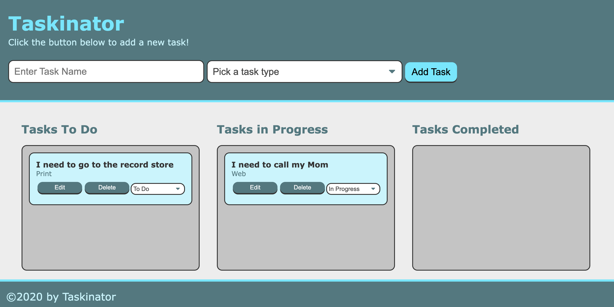

# Taskinator

### This project is a a task tracker app. This will allow you to keep track of tasks To Do, in Progress and Completed.

### This app allows you to add a new task, edit or delete a task. This also alllows you to change the status to In Progress or Completed, which then moves it to the appropriate container.

### badges

## Table of Contents

- [installation](#installation)
- [contribution guidelines](#contribution)
- [Test Instructions](#testing)
- [License](#license)
- [Questions](#questions)

### Installation
Please clone the github repo here :
https://github.com/Vinyldude8896/Taskinator

#### Install Dependencies
There are no install dependecies for this project

#### Run the program
Right click the index.html file and run in live server.

### Contribution Guidelines
N/A as of yet
### Testing
To test this app:
1. Clone the repo here : https://github.com/Vinyldude8896/Taskinator
2. Right click the index.html and open in live server
3. Try adding tasks, editing, deleteing
3. try moving the status from TO Do to In Progress or completed.

### Questions
    email address : kevinnivek@me.com
    - additional instructions 
    I can be contacted by phone as well, but prefer email contact first.

### Images of example readme.md

